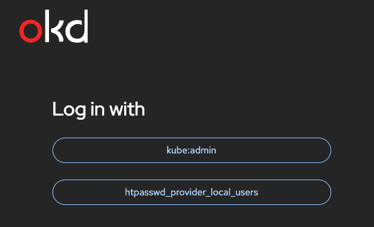

# identity-provider

## Configure an Identity Provider (IdP)
OKD ships with no persistent login mechanism by default — you must configure one.

## Setting Up Security & Logins
OKD uses OAuth built into the platform. You configure it by editing the OAuth cluster object.

## Phase 1 will use [`htpasswd`](https://httpd.apache.org/docs/current/programs/htpasswd.html)

1. Use `htpasswd` to create file

    | Description                               | Command           	
    |---                                        |---
    | Create file with first user (admin)      	| `htpasswd -c -B okd-htpasswd admin`	
    | Add more users (omit -c flag after first) | `htpasswd -B okd-htpasswd developer`

1. Create the OKD secret from the file

    `oc create secret generic htpass-secret --from-file=htpasswd=okd-htpasswd -n openshift-config`

1. Create and Apply the OAuth

    | Description                               | Command           	
    |---                                        |---
    | Create OAuth yaml file                    | [okd-htpasswd.yaml](okd-htpasswd.yaml)	
    | Apply                                     | `oc apply -f okd-htpasswd.yaml`

1. Grant your admin user cluster-admin

    `oc adm policy add-cluster-role-to-user cluster-admin admin`

1. From the OKD Web Portal Login using 'htpasswd_provider_local_users' provider

    

---
---
---

## Phase 2 will use [`KeyCloak`](https://www.keycloak.org/)

